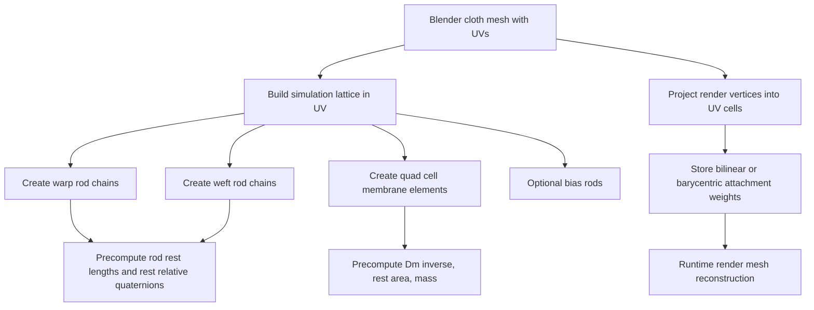
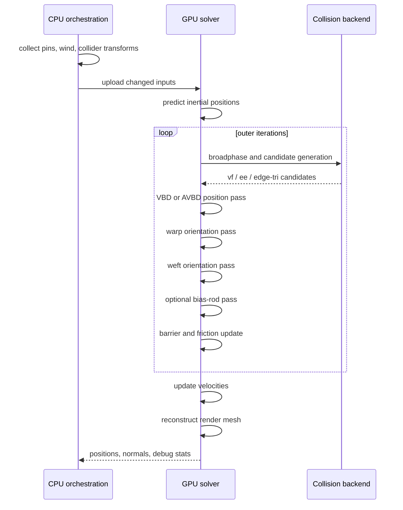

# Stable Cosserat Rods Cloth Solver Blueprint for Blender

## Executive Summary

This document is a **Codex-targeted implementation blueprint** for building a cloth solver for Blender that is **based on the Stable Cosserat Rods method**, but adapted into a practical **hybrid cloth architecture** suitable for publication with an MIT-licensed core library. The original Stable Cosserat Rods work is a rod solver, not a general triangular cloth solver: it introduces a **split position/rotation optimization**, treats rotational inertia as negligible for thin rods, derives a **closed-form local quasi-static orientation update** parameterized by an auxiliary scalar \(\lambda\), and combines that with **VBD-style position updates** and **IPC-style barrier contacts**. The Utah project page explicitly validates the method on hair, trees, yarn-level cloth, slingshots, and bridges, while the paper shows the formulation naturally supports **graphs**, which is the key opening for a cloth adaptation via a warp/weft rod network rather than a pure shell-only discretization. citeturn42view2turn32view0turn7view1turn42view4turn5view1

The most implementation-ready route is **not** to invent a brand-new Cosserat shell from scratch. Instead, the recommended design is a **hybrid rod-lattice cloth solver**: simulate a structured lattice of **warp rods**, **weft rods**, and optional **bias rods**, add a **membrane energy** on lattice cells for in-plane stretch/shear/area behavior, and attach an arbitrary render triangle mesh to that lattice through UV-based interpolation. This preserves the exact strength of Stable Cosserat Rods where it matters most—robust directional bending/twisting with stable local director updates—while giving cloth the missing 2D membrane behavior. This strategy is directly motivated by the paper’s graph support and by the fact that the Utah team already demonstrated yarn-level cloth behavior with the rod solver, but did not publish a general shell formulation. citeturn42view4turn42view2turn42view3

For contacts, the safest recommendation is to use **IPC/C-IPC concepts and code** rather than re-derive codimensional contact from memory. C-IPC was designed specifically to unify codimension-0/1/2/3 contact, including rods and shells, with **thickness**, **strain limiting**, and **additive CCD**, and the official `ipc-toolkit` repo exposes reusable barrier, friction, CCD, and derivative routines for integration into an existing simulator. For a Blender production target that must handle colliders up to roughly **300k triangles**, the most practical backend on the specified hardware is **CUDA + OptiX** on the GPU, with **Embree** as the CPU fallback and **Vulkan compute** as the portability-oriented future path. citeturn13search2turn13search1turn40search5turn40search0turn20search0turn39search4turn19search0turn19search5turn30search4

A critical publication note: the public CPU reference implementation of Stable Cosserat Rods is released under **MIT**, but the public GPU YarnBall implementation is **GPL-3.0**. Also, the official Blender Extensions Platform requires add-ons to use **GPL v3 or later**. Therefore, if the goal is “publish on MIT,” the clean path is to keep the **native core solver library MIT**, avoid copying GPL YarnBall code, and ship either a **GPL Blender wrapper** for the official Extensions platform or an off-platform distribution strategy for the wrapper if MIT-only packaging is non-negotiable. That licensing split is the single most important non-technical constraint in this project. citeturn10view0turn8view4turn17search0

## Stable Cosserat Rods Fundamentals to Carry Into Cloth

The continuous Cosserat rod state is a centerline \(x(s)\) together with an orthonormal material frame, often stored by a quaternion \(q(s)\). In the Stable Cosserat Rods discretization, positions live on vertices and orientations live on segments. The paper discretizes the stretch/shear constraint as

\[
C^{ss}_i = \frac{x_{i+1}-x_i}{l_i} - d_{i,3},
\]

where \(l_i\) is the rest length of segment \(i\), and \(d_{i,3}\) is the third director extracted from the segment orientation. Bending/twisting is discretized via the relative quaternion between neighboring segments, with a sign choice \(\phi_i\) to pick the closest quaternion pole, and the total elastic energy is the sum of segment-wise stretch/shear and bend/twist energies,

\[
E_{\text{total}}=\sum_i \frac{k^{ss}_i}{2}\|C^{ss}_i\|^2 + \sum_i \frac{k^{bt}_i}{2}\|C^{bt}_i\|^2.
\]

The paper then writes implicit Euler as a variational problem over positions and quaternions, but crucially simplifies the rotational part by arguing that for thin rods the angular momentum contribution is negligible, effectively using a **quasi-static rotation solve** with \(J=0\). citeturn32view0turn31view1

The core transferable insight is the **alternating minimization**:

\[
x = \arg\min_x \frac{1}{2h^2}\|x-y\|_M^2 + E_{\text{total}}(x,q),
\qquad
q = \arg\min_q E_{\text{total}}(x,q)\ \text{s.t.}\ |q_i|=1,
\]

with repeated passes between a position solve and a quasi-static orientation solve. The orientation update becomes local by grouping stretch effects into a variable \(v\) and all bend/twist contributions from neighboring segments into a variable \(b\). The paper derives

\[
q_i(\lambda)=\frac{v\,b\,e_3+\lambda b}{\lambda^2-\|v\|^2},
\]

and then uses the practical approximation

\[
\lambda \approx \|v\|+\|b\|,
\]

followed by quaternion normalization. An exact fixed-point refinement for \(\lambda\) is also provided, but the paper reports the approximation is usually sufficient in practice. The implementation alternates these local orientation relaxations with position updates; on the GPU, the authors report it parallelizes well with separate position/orientation passes and Jacobi-style updates. citeturn7view0turn7view1turn33view1turn42view3

For implementation clarity, it is useful to write the relative orientation explicitly as \(\Delta q_i=\bar q_i q_{i+1}\), even if the paper’s compact notation suppresses some quaternion bookkeeping. In code, each local orientation update on a node or segment only needs: the current edge tangent from positions, the rest relative rotations, and the neighboring segment quaternions. That locality is exactly why the formulation is suitable for a cloth adaptation based on a **rod graph embedded in a sheet**. The paper explicitly states the grouped \(b_i\) expression supports an arbitrary number of edge connections and therefore **naturally supports graphs**. That is the mathematical justification for using the method on warp/weft networks rather than only on single chains. citeturn42view4

The paper’s implementation section is also important for transfer. Once orientations are treated separately, the stretch/shear position term becomes quadratic enough that the position update can be handled efficiently with **Vertex Block Descent**, and contacts are added with an **IPC-style barrier energy**. In other words, the production pattern to preserve is:

1. predict inertial positions,
2. solve positions with a robust local optimizer,
3. solve directors/quaternions quasi-statically with the closed-form update,
4. handle contact with barrier energies and CCD,
5. update velocities from the solved positions. citeturn33view1turn5view1turn24search1turn37search0

## Proposed Cloth Adaptation Architecture

The recommended cloth adaptation is a **hybrid lattice-sheet model** with two layers:

| Layer | Role | Recommended representation |
|---|---|---|
| Simulation layer | Physics DOFs | Structured UV-space lattice of nodes plus warp/weft rod segments and quad cells |
| Render layer | Blender-visible surface | Arbitrary triangle mesh attached to simulation lattice via UV interpolation |

This is the most direct extension of Stable Cosserat Rods because it preserves the rod formulation on the simulation side and avoids forcing the paper into a shell theory it did not publish. It also aligns with the paper’s demonstrated yarn-level cloth behavior and graph support. citeturn42view2turn42view3turn42view4

The preprocessing pipeline should be:



The simulation variables are:

\[
x_a \in \mathbb{R}^3,\quad v_a \in \mathbb{R}^3,\quad m_a,\quad
q^{u}_e \in \mathbb{H},\quad q^{v}_e \in \mathbb{H},
\]

for lattice nodes \(a\), warp segments \(e\), and weft segments \(e\). Optional bias rods \(q^b_e\) can be added if the cloth must capture strong bias-direction bending or shear. The render mesh is not simulated directly; it is reconstructed by interpolation:

\[
y_r = \sum_{a \in \mathcal{C}(r)} w_{ra}\,x_a,
\qquad
\sum_a w_{ra}=1,\quad w_{ra}\ge 0,
\]

where \(\mathcal C(r)\) is the lattice cell containing render vertex \(r\) in UV-space. Use bilinear weights on quads, or barycentric weights if you triangulate each cell. This makes the simulation stable, sparse, and resolution-independent from the render mesh. citeturn42view2turn35search2

The full cloth energy should be

\[
E_{\text{cloth}}
=
E_{\text{rod}}^{u}
+
E_{\text{rod}}^{v}
+
E_{\text{mem}}
+
E_{\text{seam}}
+
E_{\text{attach}}
+
E_{\text{coll}}
+
E_{\text{fric}}.
\]

The rod terms are the Stable Cosserat Rods energies applied independently to every warp row and weft column:

\[
E_{\text{rod}}^{u}
=
\sum_{e \in \mathcal{E}_u}\frac{k^{ss,u}_{e}}{2}\|C^{ss,u}_{e}\|^2
+
\sum_{b \in \mathcal{B}_u}\frac{k^{bt,u}_{b}}{2}\|C^{bt,u}_{b}\|^2,
\]

and likewise for the weft family. Use separate parameter sets for warp and weft to capture anisotropy. This is physically meaningful for cloth because woven and knitted fabrics are almost always direction-dependent. The Utah paper shows the solver already handles yarn-level cloth behavior and arbitrary rod graphs, while yarn-level cloth literature and homogenized cloth/knitwear work strongly support explicitly modeling directional yarn effects. citeturn42view3turn42view4turn26search0turn26search6turn26search4

For the 2D membrane behavior, use a standard surface FEM deformation gradient on each quad cell \(c\). If the rest UV coordinates of the four cell corners are \(U_0,U_1,U_2,U_3\), triangulate each quad into two triangles \((0,1,2)\) and \((0,2,3)\) for the membrane calculation only. For each triangle \(t=(i,j,k)\),

\[
D_m = 
\begin{bmatrix}
U_j-U_i & U_k-U_i
\end{bmatrix},
\qquad
D_s = 
\begin{bmatrix}
x_j-x_i & x_k-x_i
\end{bmatrix},
\qquad
F = D_s D_m^{-1}\in \mathbb{R}^{3\times 2}.
\]

Then define the surface metric

\[
C = F^\top F =
\begin{bmatrix}
C_{11} & C_{12}\\
C_{12} & C_{22}
\end{bmatrix}.
\]

A practical anisotropic cloth membrane energy is

\[
W_{\text{mem}}(C)
=
\frac{k_u}{2}\big(\sqrt{C_{11}}-1\big)^2
+
\frac{k_v}{2}\big(\sqrt{C_{22}}-1\big)^2
+
\frac{k_{sh}}{2}C_{12}^2
+
\frac{k_A}{2}\big(\sqrt{\det C}-1\big)^2.
\]

The element energy is

\[
E_{\text{mem},t}=A_t^0 W_{\text{mem}}(C_t).
\]

This gives warp stretch, weft stretch, in-plane shear, and areal response in one compact expression. It is also straightforward to differentiate at the element level and is consistent with the standard shell/cloth FEM view based on \(F=D_sD_m^{-1}\). citeturn11search1turn11search3turn13search1

A very useful derivative form is:

\[
\frac{\partial E_{\text{mem},t}}{\partial D_s}
=
2A_t^0\, D_s D_m^{-1}
\left(
\frac{\partial W_{\text{mem}}}{\partial C}
\right)
D_m^{-T}.
\]

Because \(D_s\) is affine in \(x_i,x_j,x_k\), this makes it easy to assemble local gradients and Hessians into either a Newton solver or a VBD/AVBD local-vertex solve. For a production solver, implement the membrane element derivatives once and test them with finite differences; let Codex generate the repetitive algebra or use element-local autodiff. This is a better engineering trade than trying to hand-simplify every derivative before you have validation. citeturn11search3turn24search1turn37search0

The coupling between rod-like elements and the cloth sheet is then simple and strong:

* the **same lattice nodes** are shared by rod chains and membrane cells;
* warp/weft rods provide **directional bend/twist stiffness**;
* membrane cells provide **2D stretch, shear, and area response**;
* the render mesh is a slave surface attached in UV-space.

That shared-DOF construction is superior to weak spring attachments between an independent rod model and an independent shell model because it eliminates drift and reduces tuning burden. The only explicit attachment energy you still need is for the render mesh if it is finer than the simulation lattice.

## Numerical Solvers, Contact Handling, and Performance Engineering

The recommended per-step algorithm is:



The concrete step should be:

\[
y = x^n + h v^n + h^2 M^{-1}f_{\text{ext}},
\]

initialize \(x \leftarrow y\), keep previous rod quaternions \(q^u,q^v\), then iterate. In each outer iteration:

1. update contact candidates and barrier state,
2. perform one or more **position sweeps** with VBD or AVBD,
3. update all warp segment quaternions using the Stable Cosserat local solve,
4. update all weft segment quaternions,
5. optionally update bias rods,
6. check residual reduction and contact feasibility.

Finally,

\[
v^{n+1}=\frac{x^{n+1}-x^n}{h}.
\]

This keeps the solver extremely close to the paper’s successful pattern while adding only the membrane layer needed for sheets. citeturn32view0turn33view1turn24search1turn37search0

The production recommendation is to use **AVBD** when hard pins, stitches, or strong contact stacks are present, and plain **VBD** only for the simplest preview mode. VBD is attractive because it solves the variational form of implicit Euler via local vertex-level Gauss-Seidel iterations and is unconditionally stable; AVBD extends it with an augmented Lagrangian mechanism to handle hard constraints and improve convergence under high stiffness ratios. Stable Cosserat Rods already piggybacks on VBD for positions; cloth benefits from the same family of solvers because a local vertex update remains cheap even when the membrane energy adds nontrivial \(12\times12\) element Hessians. citeturn24search1turn37search0turn33view1

A good solver decision table is:

| Solver path | When to use | Strengths | Weaknesses |
|---|---|---|---|
| Symplectic explicit + penalty contacts | Early prototype only | Easiest to code | Unstable for stiff cloth, poor large-\(h\) behavior |
| Full Newton + line search + IPC | Offline validation, ground truth mode | Best physical fidelity, easiest to compare against literature | Expensive sparse solves, harder GPU scaling |
| VBD + rod orientation split | Interactive preview | Good stability, simple local updates, aligns with SCR paper | Hard constraints converge slowly |
| **AVBD + rod orientation split** | **Recommended production path** | Stable, local, better hard constraints and high stiffness ratios | More implementation work than baseline VBD |
| PD-style local/global + rod orientation split | If you already have PD infrastructure | Mature cloth ecosystem | Barrier contact integration is less direct than IPC/C-IPC |

The cloth solver itself should expose all these modes only if you need them. Otherwise, Codex should implement **two modes**: `interactive_avbd` and `offline_newton`. That keeps the codebase small and testable. citeturn24search1turn37search0turn13search2turn24search2

For linear algebra, use local solvers in the interactive path and sparse direct or preconditioned iterative solvers only in the offline path or for coarse corrections. Eigen documents `SimplicialLDLT` as a sparse LDL\(^T\) direct solver for SPD systems, and also offers `ConjugateGradient` and `BiCGSTAB` with preconditioners. On NVIDIA GPUs, NVIDIA now recommends **cuDSS** for sparse direct solves; its documented workflow is analysis, factorization, and solve via `cudssExecute()`, with matrix objects created from CSR or dense storage. If you need a CPU iterative fallback, **AMGCL** is a strong choice because it is header-only, supports AMG-preconditioned CG/BiCGStab/GMRES, and can accelerate the solve phase with OpenMP, CUDA, or OpenCL backends. citeturn22search4turn22search0turn18search11turn21search0turn21search2turn41search0turn41search2turn41search7turn23search0

A practical library table is:

| Role | First choice | Why |
|---|---|---|
| Dense/sparse CPU algebra | Eigen | Header-only, excellent prototype velocity, direct + iterative sparse solvers citeturn22search4turn22search0turn18search11 |
| GPU sparse direct solve | cuDSS | Current NVIDIA sparse direct path, analysis/factor/solve workflow, hybrid host/device mode for some sizes citeturn21search0turn21search8turn21search17turn41search0 |
| CPU iterative preconditioning | AMGCL | Strong AMG-based preconditioning, MIT, multiple backends citeturn23search0 |
| Collision barrier and CCD | ipc-toolkit / Codim-IPC | Reusable IPC barriers, CCD, friction, derivatives, codimensional contact reference code citeturn40search5turn40search0 |
| CPU geometry queries | Embree + libigl | Embree for ray/BVH queries, libigl for AABB and point-mesh distance utilities citeturn19search0turn19search5turn19search6turn35search0turn35search2 |
| NVIDIA RT collision backend | OptiX | Triangle/custom primitive support and hardware RT acceleration structures citeturn20search0turn39search4 |
| Python binding | nanobind, or pybind11 if you prefer maturity | nanobind is smaller/faster; pybind11 is battle-tested and widely used citeturn34search3turn34search9turn34search0 |

For collision handling against colliders up to around **300k triangles**, the scalable pipeline should be:

1. **Broadphase**
   * build one static BVH/AS for static colliders,
   * refit only transforms for rigid movers,
   * use a uniform grid or BVH over cloth primitives for self-collision,
   * ignore 1-ring and 2-ring adjacency in self-collision.

2. **Narrowphase**
   * cloth-vs-collider: vertex-face and edge-edge for sheet triangles,
   * rod-vs-collider: segment-triangle or endpoint-face depending thickness model,
   * keep feature IDs from broadphase to avoid repeated expensive searches.

3. **CCD**
   * use **ACCD / IPC-style conservative advancement** for robust time-of-impact lower bounds,
   * for interactive preview, substep if a candidate set explodes,
   * for offline mode, do exact codimensional candidate processing with the IPC toolkit.

4. **Response**
   * solve contacts as barrier potentials inside the implicit objective,
   * use smooth lagged friction, not per-contact explicit impulses,
   * maintain a minimum geometric thickness \(t\) by offsetting the contact distance threshold.

This is not optional engineering polish: for thin cloth and rod-like yarn elements, continuous collision becomes mandatory because discrete tests miss tunneling at large time steps. C-IPC’s published contributions are exactly strain limiting, thickness-aware codimensional contact, and ACCD, and the official toolkit exists precisely so you do not have to rebuild that stack from scratch. citeturn13search2turn13search1turn40search5turn40search0

On the target machine, the backend decision should be:

| Backend | Recommendation on AMD 9950X3D + RTX 5070 Ti | Notes |
|---|---|---|
| **CUDA + OptiX** | **Best default** | The GPU is Blackwell-based with 8960 CUDA cores and 16 GB GDDR7; this is the most natural fit for the Utah GPU implementation style and for BVH-heavy collision work. citeturn36search1turn20search0 |
| CPU + Embree + Eigen | Best fallback / debug path | The CPU has 16 cores, 32 threads, PCIe 5.0, DDR5 support, and plenty of system RAM headroom for offline validation. citeturn14search1turn19search5turn22search4 |
| Vulkan compute | Best portability path | Compute shaders are mandatory on Vulkan devices and work well for headless compute, but you lose the CUDA/OptiX ecosystem advantage. citeturn30search4turn30search8 |
| Metal | macOS future backend only | Metal compute is strong, but this is not the best first implementation for the stated hardware. citeturn30search1turn30search17 |
| OpenCL | Only if portability trumps development velocity | Open standard, but weaker overall path for this specific Blender + NVIDIA target. citeturn30search3turn30search15 |
| DirectML | Not recommended | Officially ML-oriented, and the public repo states maintenance mode. citeturn30search2turn30search6 |

For memory layout and parallelization, use **SoA everywhere**. Store `pos_x`, `pos_y`, `pos_z`, `vel_x`, `vel_y`, `vel_z`, `inv_mass`, `flags`, and separate packed `float4` arrays for quaternions. Rod adjacency should be CSR-like or fixed-degree arrays, and quad-cell connectivity should be tightly packed in `uint4`. Sort nodes by lattice order or Morton code so neighboring rods and cells map to nearby memory. Use graph coloring for vertex-local VBD/AVBD passes and for rod orientation passes. On GPU, separate kernels for warp, weft, and bias rods avoid divergence and improve cache behavior; on CPU, parallelize per color with OpenMP or TBB-like scheduling. These are not paper claims; they are the right systems choices for the target hardware and for the paper’s already-demonstrated GPU-friendly split passes. citeturn42view3turn14search1turn36search1

A realistic **engineering target envelope** for this hardware, clearly marked as an inference rather than a published benchmark, is:

| Simulation lattice | Typical use | Plausible target |
|---|---|---|
| \(64\times64\) | fast interactive preview | 60–120 FPS |
| \(128\times128\) | garment preview | 30–60 FPS |
| \(256\times256\) | high-quality preview | 10–25 FPS |
| \(512\times512\) | baking / near-offline | 2–8 FPS |

Those targets are extrapolated from the Stable Cosserat Rods GPU results on an RTX 3090, from C-IPC/modern GPU cloth performance ranges, and from the RTX 5070 Ti hardware class; they should be used as profiling goals, not as guaranteed results. In the SCR paper, the Utah implementation reports 255,607 vertices at about 107 ms/frame for knitted letters, hair with over 1.4 million vertices at about 7 ms/frame excluding collisions, and a near-2M-DOF knit example at about 4 FPS on an RTX 3090. Modern GPU cloth work also reports interactive regimes around one million DOFs under specialized formulations. citeturn25view2turn25view0turn25view1turn28search0turn28search4turn36search1

## Blender Integration, API Surface, and Licensing Strategy

From Blender’s side, the extension should be treated as a **Python UI and scene-interop layer** around a native solver core. Blender’s official documentation states that add-ons extend Blender via Python, can bundle third-party modules via **Python wheels**, and can be built/installed through Blender’s extension tooling. It also states that for add-ons on the official Extensions Platform, the required license is **GPL v3 or later**. That means the correct engineering/legal packaging is:

* **MIT native core**: C++ solver library, data structures, tests, command-line tools.
* **GPL Blender wrapper**: Python add-on plus compiled wheel/module if you want the official Blender Extensions Platform.
* **Do not copy GPL YarnBall code** into the MIT core.
* If MIT-only distribution is absolutely required for the whole package, do not target the official Blender Extensions Platform without legal review. citeturn29search3turn29search0turn29search1turn29search2turn17search0turn10view0turn8view4

The Blender data ingestion path should use evaluated scene geometry. Blender’s API documentation exposes `to_mesh()` on evaluated geometry via the depsgraph, and `foreach_set` / `foreach_get` for fast bulk access to basic-type attributes in collections. In practice, the add-on should:

1. obtain the evaluated cloth and collider meshes from the depsgraph,
2. flatten vertex positions and triangle indices into NumPy arrays,
3. pass them to the native solver in bulk,
4. on output, write solved render positions back with `foreach_set("co", ...)`.

Do not iterate vertex-by-vertex in Python during playback; that will dominate frame time long before the solver does. citeturn17search2turn17search1

A minimal Python-facing API should look like this:

```python
import stablecloth as sc

cfg = sc.Config(
    sim_mode="interactive_avbd",
    dt=1.0 / 60.0,
    lattice_u=128,
    lattice_v=128,
    use_bias_rods=False,
    cloth_thickness=0.0015,
    rod_radius=0.00075,
    collision_backend="cuda_optix",
)

solver = sc.Solver(cfg)

solver.set_cloth_mesh(
    render_vertices=V_render,      # (N,3) float32
    render_faces=F_render,         # (M,3) int32
    uv=UV_render,                  # (N,2) float32
)

solver.set_material(
    ku=8e3, kv=6e3, kshear=2e3, karea=5e3,
    kss_u=9e3, kbt_u=2e-2,
    kss_v=7e3, kbt_v=1.5e-2,
)

solver.set_pins(pin_ids, pin_targets)
solver.set_colliders(collider_list)

for frame in range(num_frames):
    solver.set_external_forces(gravity=(0, 0, -9.81), wind=wind_field(frame))
    solver.step()
    V_out = solver.get_render_vertices()
```

The native C++ API should mirror this and avoid Blender-specific types:

```cpp
struct ClothMesh {
    span<const float3> V;
    span<const uint3>  F;
    span<const float2> UV;
};

struct ColliderMesh {
    span<const float3> V;
    span<const uint3>  F;
    float4x4 transform;
    bool is_static;
};

class StableClothSolver {
public:
    void initialize(const ClothMesh&, const Config&);
    void setColliders(span<const ColliderMesh>);
    void setPins(span<const uint32_t> ids, span<const float3> targets);
    void setExternalForces(const ExternalForces&);
    void step(float dt);
    span<const float3> renderVertices() const;
    SolverStats stats() const;
};
```

The recommended I/O contract is:

| Category | Inputs | Outputs |
|---|---|---|
| Geometry | render mesh vertices/faces/UVs; optional sewing data | solved render vertices/normals |
| Simulation | lattice resolution, time step, solver mode, iterations | per-step stats, residuals, contact counts |
| Materials | directional stretch, bend, shear, area, thickness, friction | optional fitted material cache |
| Scene | pins, kinematic handles, gravity, wind, collider meshes/transforms | collision debug contacts, TOIs |
| Persistence | `.blend` via Blender; optional `.npz`/binary caches for baked runs | baked cache files, screenshots, regression images |

For file formats, keep the solver core agnostic: Blender already imports OBJ/FBX/glTF/USD into evaluated meshes, so the core should only see arrays. For bake/export, `.npz` is fine for a research prototype; for production, use a compact binary frame cache with a header, frame offsets, and optionally Zstd compression. That decision is implementation-specific and does not affect the numerical method.

For Python bindings, choose **nanobind** if build speed, binary size, and runtime overhead matter more than ecosystem familiarity; choose **pybind11** if you want maximum example coverage and lower project risk for Codex. Both are good. Nanobind has the more attractive performance story; pybind11 remains the default safe choice when your team already knows it. citeturn34search3turn34search9turn34search0

## Validation, Prioritized References, and Reference Implementation Outline

Testing must be built into the solver from day one. The required validation stack is:

| Test family | What it checks | Acceptance criterion |
|---|---|---|
| Unit tests | vector math, quaternion ops, element energies, gradients, Hessians | finite-difference relative error below \(10^{-5}\) in float32 debug mode |
| Invariance tests | translation / rotation / vertex ordering invariance | same energy within tolerance |
| Rest-state tests | zero strain, zero external force | no drift over 1k steps |
| Convergence tests | VBD/AVBD outer iterations, rod GS iterations | monotone decrease of residual/energy after warm start |
| Contact tests | cloth on sphere, cloth on sharp edge, rod crossing | no visible interpenetration, CCD always feasible |
| Visual regression | drape, fold, drop, pinched corners, swirling wind | image diff under threshold |
| Cross-solver tests | compare `interactive_avbd` vs `offline_newton` | consistent qualitative deformation; bounded L2 position gap |

Stable Cosserat Rods emphasizes invariance and the zero-strain consistency of the approximate \(\lambda\) update, while IPC/C-IPC emphasize feasibility, non-intersection, and strict strain-limit satisfaction. Your test philosophy should mirror exactly those strengths. citeturn7view1turn33view1turn13search2turn13search1

The most important primary and official references, in the order Codex should consult them, are:

| Priority | Source | Why it matters |
|---|---|---|
| Highest | **Stable Cosserat Rods** project page, paper, and MIT CPU reference code citeturn42view2turn32view0turn10view0 | Core method, equations, reference implementation, license-safe starting point |
| Highest | **Codimensional Incremental Potential Contact** and `ipc-toolkit` citeturn13search2turn13search1turn40search5turn40search0 | Robust contact, thickness, CCD, friction |
| High | **Vertex Block Descent** and **Augmented Vertex Block Descent** citeturn24search1turn37search0 | Position solver family that best matches the SCR split scheme |
| High | **Discrete Elastic Rods** citeturn26search25 | Classical rod background and validation reference |
| High | **Discrete Shells** citeturn11search1 | Thin-sheet discretization background for membrane/bending thinking |
| High | **Curved Three-Director Cosserat Shells with Strong Coupling** citeturn11search0turn11search16 | Best current reference if you later move from hybrid rod-lattice cloth to a full micropolar shell |
| Medium | **Yarn-level Simulation of Woven Cloth** and **Homogenized Yarn-Level Cloth** citeturn26search0turn26search6 | Directional cloth mechanics and yarn-to-sheet modeling intuition |
| Medium | **Volumetric Homogenization for Knitwear Simulation** citeturn26search4 | Utah-adjacent macro modeling for knitted behavior |
| Medium | **Efficient GPU Cloth Simulation with Non-distance Barriers and Subspace Reuse** citeturn28search0turn28search4 | Optional future performance path if you rework contacts for very high-resolution cloth |
| Medium | Blender, cuDSS, OptiX, Embree, libigl, nanobind/pybind11 docs citeturn29search3turn21search0turn20search0turn19search0turn35search2turn34search3turn34search0 | Toolchain and integration details |

A minimal module breakdown for Codex should be:

| Module | Responsibility |
|---|---|
| `core/math` | float3/float4, quaternion, small-matrix ops, PSD projection |
| `core/mesh` | lattice builder, UV projection, attachments, topology CSR |
| `core/rods` | segment directors, rest quaternions, SCR local orientation update |
| `core/membrane` | \(F\), \(C\), element energies, gradients, Hessians |
| `core/solver` | VBD/AVBD loop, Newton fallback, residual computation |
| `core/collision` | broadphase abstraction, candidate buffers, IPC toolkit bridge |
| `backend/cuda` | kernels, OptiX AS build/query, device memory |
| `backend/cpu` | Eigen/Embree/libigl fallback |
| `bindings/python` | nanobind or pybind11 API |
| `blender_addon` | scene extraction, UI panels, playback, baking |
| `tests` | unit, regression, golden scenes |
| `tools` | CLI runner, benchmark harness, cache converter |

A minimal reproducible outline is:

```text
stablecloth/
  CMakeLists.txt
  src/
    core/math/
    core/mesh/
    core/rods/
    core/membrane/
    core/solver/
    core/collision/
    backend/cuda/
    backend/cpu/
    bindings/python/
  blender_addon/
    __init__.py
    operators.py
    panels.py
    runtime.py
  tests/
    unit/
    regression/
    scenes/
  tools/
    bench_cli/
    golden_runner/
```

And the essential pseudocode is:

```python
def step(state, scene, cfg):
    # Prediction
    y = state.x + cfg.dt * state.v + (cfg.dt * cfg.dt) * scene.external_accel

    x = y.copy()
    q_u = state.q_u.copy()
    q_v = state.q_v.copy()

    contact_state = collision_begin_step(x, state.x_prev, scene.colliders, cfg)

    for outer in range(cfg.outer_iters):
        # Position update
        for color in state.vertex_colors:
            for a in state.vertices_of_color[color]:
                g, H = inertial_grad_hess(a, x, y, state, cfg)
                g += membrane_grad(a, x, state.membrane, cfg)
                g += rod_stretchshear_grad(a, x, q_u, q_v, state.rods, cfg)
                g += seam_grad(a, x, state.seams, cfg)
                g += contact_grad(a, x, contact_state, cfg)

                H += membrane_hess(a, x, state.membrane, cfg)
                H += rod_stretchshear_hess(a, x, q_u, q_v, state.rods, cfg)
                H += seam_hess(a, x, state.seams, cfg)
                H += contact_hess(a, x, contact_state, cfg)

                H = psd_project(H) + cfg.local_damping * I3
                dx = solve_3x3(H, -g)
                x[a] += cfg.relaxation * dx

        # Rod orientation update
        for family in (state.warp_families, state.weft_families):
            for rod_color in family.segment_colors:
                for seg in family.segments_of_color[rod_color]:
                    v = compute_v(seg, x, family, cfg)
                    b = compute_b(seg, family.q, family.rest_q, cfg)
                    lam = norm(v) + norm(b)  # approximate SCR update
                    q = scr_q_of_lambda(v, b, lam)
                    family.q[seg] = normalize(q)

        if cfg.use_avbd:
            update_augmented_lagrange_state(state, x, cfg)

        contact_state = collision_refresh(x, state.x_prev, scene.colliders, cfg)

        if converged(x, q_u, q_v, contact_state, cfg):
            break

    v_new = (x - state.x) / cfg.dt
    render_x = reconstruct_render_surface(x, state.attachments)

    state.x_prev = state.x
    state.x = x
    state.v = v_new
    state.q_u = q_u
    state.q_v = q_v
    state.render_x = render_x
    return state
```

The one thing Codex should **not** do is attempt to reproduce the entire YarnBall GPU implementation line-for-line if the MIT publication goal is serious. The correct plan is to use the **MIT StableCosseratRods CPU code as the license-safe algorithmic reference**, implement a new GPU path from the paper and the mathematics in this document, and isolate Blender-specific code in a separate wrapper layer. That gives you a legally clean, technically coherent, and realistically maintainable path to a Blender cloth extension based on Stable Cosserat Rods. citeturn10view0turn8view4turn42view2